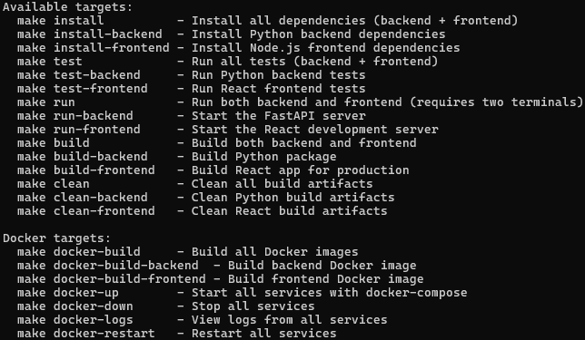
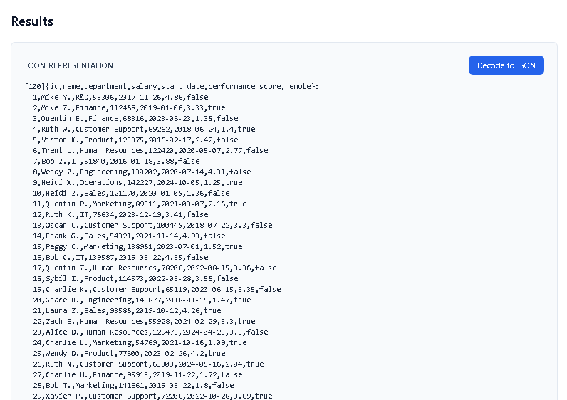
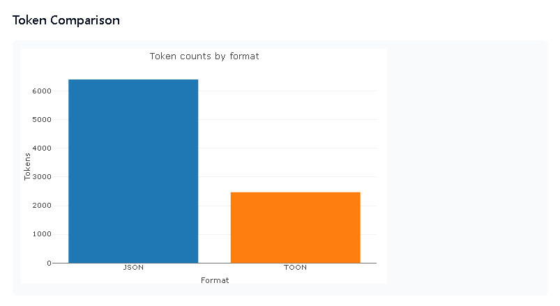
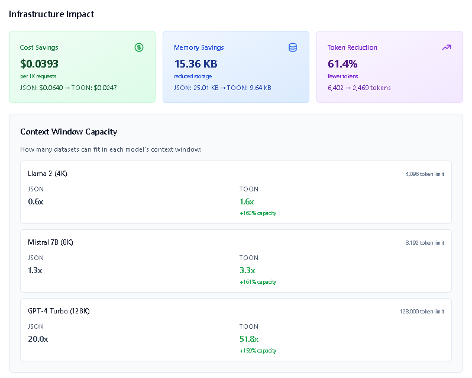
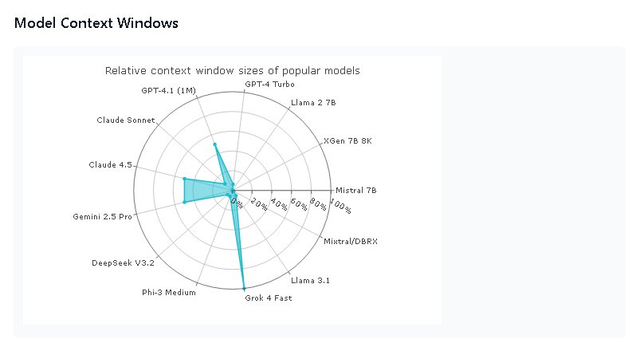
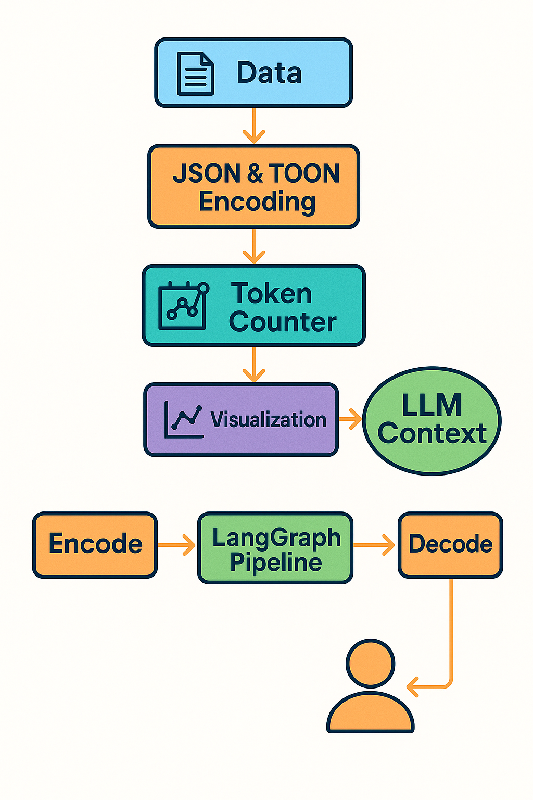
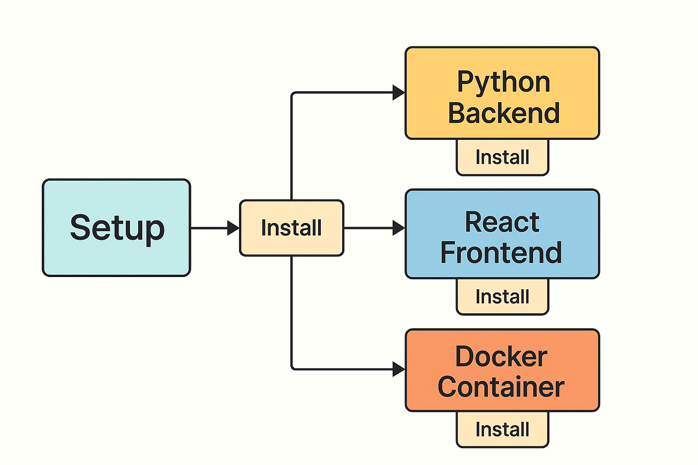

# TOON Token Savings Demonstration

This project explores **Token‑Oriented Object Notation (TOON)** as an alternative to the ubiquitous JSON format for communicating structured data to large‑language models (LLMs).  TOON is a human‑readable, indentation‑based format that combines the conciseness of YAML with tabular arrays reminiscent of CSV.  The result is a syntax that reduces the number of tokens required to represent complex data structures, translating directly into lower API costs and larger effective context windows when interacting with modern LLMs.

The repository contains a set of Python modules, a simple API server, integration examples for LangGraph pipelines and MCP servers, a React front‑end for non‑coders, and a suite of tests.  A synthetic dataset of employee records is provided to demonstrate encoding and decoding workflows.  This README describes the motivation for the project, installation instructions, benchmark results and visualisations, context‑window comparisons across multiple models, and a roadmap for future enhancements.

## Motivation

### Why care about tokens?
Most language‑model APIs bill users based on the number of tokens processed.  A token represents roughly **four characters of input** or **three quarters of a word**.  When prompts become large—e.g. sending long documents, code bases or configuration files—the number of tokens grows quickly.  High token usage leads not only to **higher cost** but also to **context window limitations**: each model can process only a finite number of tokens in a single request.  For example, the second‑generation Llama 2 open‑source model has a context length of **4,096 tokens**.  Even cutting‑edge proprietary models such as GPT‑4 Turbo are limited to **128 k tokens** per request.

### What is TOON?
The TOON specification (Token‑Oriented Object Notation) is defined in the open‑source [`toon-format/spec`](https://github.com/toon-format/spec) repository.  It encodes hierarchical data using indentation, supports tabular arrays with minimal markup, and eschews punctuation like braces and brackets.  Benchmarks reported by the authors show that TOON representations typically use **20–40 % fewer tokens** than JSON while preserving or improving downstream accuracy.  The Python module `toon-format` provides functions for encoding, decoding and counting tokens.

> **Note:** This project uses the `toon-format` package from GitHub which includes a working encoder implementation. See the [Installation](#installation) section for details.

### Project goals

This project aims to:

1. **Demonstrate token savings** by encoding a publicly available JSON‑like dataset into TOON and comparing token counts.  Synthetic employee records are included for reproducibility.
2. **Visualise the savings** using multiple chart types, so both developers and non‑technical stakeholders can quickly grasp the benefits.
3. **Compare context‑window limits** of popular open‑source and proprietary models.  The repository includes metadata for several models (see below) and discusses how token savings translate into longer prompts and larger effective context windows.
4. **Provide integration examples** for LangGraph pipelines and MCP servers, showing how TOON can slot into existing tool‑calling frameworks and remote execution environments.
5. **Offer a React front‑end** for executives and analysts who wish to upload their own datasets and view token savings without writing code.
6. **Identify areas for improvement** in the current TOON specification, particularly around scientific notation and edge cases, and propose future enhancements.

## Contents

| Path | Description |
| --- | --- |
| `data/` | Synthetic datasets used in the demonstrations (e.g. `employee_records.json`). |
| `src/` | Python modules for data loading, encoding/decoding, token counting, visualisation and API server. |
| `pipelines/` | Markdown guides for integrating TOON into LangGraph and MCP pipelines. |
| `react-frontend/` | A React application that lets users upload files and view token counts and charts. |
| `tests/` | Unit and integration tests. |
| `docs/` | Additional documentation and assets (diagrams and images). |

## Installation

### 1. Clone the repository

```bash
git clone https://github.com/scmclimited/toon-token-savings.git
cd toon-token-savings
```

> **Note:** At the time of writing we cannot automatically create a public GitHub repository via this interface.  To publish the project, clone it locally, then create a new repository on GitHub and push the contents.

### 2. Set up Python environment (Python 3.13)

We recommend using **conda** or **venv** to isolate dependencies.  The project supports Python 3.13.

#### Using `conda`

```bash
conda create -n toon-env python=3.13
conda activate toon-env
pip install -r requirements.txt
pip install -e .  # Install project in editable mode for tests
```

#### Using `virtualenv`

```bash
python3.13 -m venv .venv
source .venv/bin/activate  # On Windows: .venv\Scripts\activate
pip install -r requirements.txt
pip install -e .  # Install project in editable mode for tests
```

> **Important:** After installing dependencies, verify that the TOON encoder works by running `python -c "from toon_format import encode; print(encode({'test': 'data'}))"`. This should output TOON-formatted text without errors. If you see `NotImplementedError`, you may have the PyPI version installed instead of the GitHub version. Reinstall with `pip uninstall toon-format -y && pip install git+https://github.com/toon-format/toon-python.git`.

The `requirements.txt` file lists all necessary packages, including:

* `toon-format` (from GitHub) – encode/decode TOON and estimate token savings. **Note:** The PyPI version (0.1.0) doesn't have a working encoder, so we use the GitHub version (`git+https://github.com/toon-format/toon-python.git`) which includes a working implementation.
* `tiktoken` – tokeniser used by OpenAI models.
* `pandas`, `numpy` – data handling.
* `matplotlib`, `plotly` – visualisations.
* `fastapi`, `uvicorn`, `pydantic`, `python-multipart` – API server and form data handling.
* `pytest` – testing framework.

### 3. Starting the API server (required before frontend)

**Important:** The React frontend requires the FastAPI backend server to be running. Start the server first before launching the frontend.

The FastAPI server exposes endpoints for encoding, decoding and comparing token counts. To run it locally:

```bash
# Using uvicorn directly
uvicorn src.server:app --reload

# Or using the Make script
make run-backend

# Or using the pyproject.toml script (after installation)
toon-server
```

The server will start on `http://localhost:8000`. Open `http://localhost:8000/docs` to view the interactive API documentation.

> **Note:** If you encounter a `RuntimeError: Form data requires "python-multipart" to be installed` error, ensure you have installed all dependencies from `requirements.txt`. Run `pip install python-multipart` if needed.

### 4. Install Node.js and React dependencies (for the front‑end)

Once the API server is running, set up and start the React frontend. The React application is located in `react-frontend/`. Install dependencies using `npm`:

```bash
cd react-frontend
npm install
npm start
```

This starts a development server at `http://localhost:3000` where you can upload datasets, run comparisons and view charts. The frontend will automatically connect to the API server running on port 8000. See the `react-frontend/README.md` for more details.

> **Important:** Make sure the API server (step 3) is running before starting the React frontend, otherwise file uploads will fail.

> **Note on npm audit vulnerabilities:** After running `npm install`, you may see security vulnerabilities reported by `npm audit`. These are in development dependencies (jest, webpack-dev-server, etc.) that come from `react-scripts@5.0.1` and are **safe to ignore for development**. They do not affect production builds. **Do not run `npm audit fix --force`** as it will break the installation by downgrading `react-scripts` to an invalid version. The regular `npm audit fix` command cannot fix these vulnerabilities without breaking changes.

### 5. Running the Python scripts

The entry point of the demonstration is the `src/app.py` script.  It loads the employee dataset, encodes it into both JSON and TOON, counts tokens, prints a comparison table and generates charts.

```bash
python -m src.app --data data/employee_records.json --output reports/demo_results
```

Options include:

* `--data`: path to the input JSON file.
* `--models`: comma‑separated list of models to consider when normalising context windows.
* `--no-plots`: skip chart generation.

### 6. Using Make Scripts

The project includes a `Makefile` with convenient commands for common tasks. After installing dependencies, you can use:

```bash
# Install all dependencies
make install

# Run backend server
make run-backend

# Run frontend (in a separate terminal)
make run-frontend

# Run all tests
make test

# Build for production
make build

# Clean build artifacts
make clean
```

See `make help` for a complete list of available commands.



### 7. Using Docker

The project includes Dockerfiles for both backend and frontend, plus a `docker-compose.yml` for easy orchestration. This is the recommended approach for production deployments.

#### Building Docker Images

```bash
# Build all images
make docker-build

# Or build individually
make docker-build-backend
make docker-build-frontend

# Or use docker-compose
docker-compose build
```

#### Running with Docker Compose

```bash
# Start all services
make docker-up
# Or: docker-compose up -d

# View logs
make docker-logs
# Or: docker-compose logs -f

# Stop all services
make docker-down
# Or: docker-compose down

# Restart services
make docker-restart
```

After starting, the services will be available at:
- **Backend API**: http://localhost:8000
- **Frontend**: http://localhost:3000
- **API Docs**: http://localhost:8000/docs

#### Individual Docker Builds

You can also build and run containers individually:

```bash
# Backend
docker build -t toon-token-savings-backend -f Dockerfile.backend .
docker run -p 8000:8000 toon-token-savings-backend

# Frontend
docker build -t toon-token-savings-frontend -f Dockerfile.frontend .
docker run -p 3000:80 toon-token-savings-frontend
```

> **Note:** When running containers individually, ensure the frontend container can reach the backend. You may need to configure the frontend to use the backend's container name or IP address instead of `localhost`.

### 8. Running tests

Unit and integration tests live in the `tests/` directory. The project should already be installed in editable mode from step 2. Run all tests:

```bash
# Using pytest directly (recommended)
python -m pytest tests/ -v

# Or using pytest command if available
pytest -q
```

**Note:** Make sure you're using the correct Python environment. If you're using conda, activate your environment first:
```bash
conda activate toon-env
python -m pytest tests/ -v
```

The test suite includes:
- `test_dataset.py` – Tests for data loading and TOON encoding/decoding
- `test_token_counter.py` – Tests for token counting and format comparison
- `test_server.py` – Tests for the FastAPI server endpoints

See the [debugging](#debugging) section for tips on failing tests.

## Benchmark Data

The synthetic dataset `employee_records.json` contains 100 mock employee records with fields such as `id`, `name`, `department`, `salary`, `start_date`, `performance_score` and `remote`.  It was generated using Python’s `random` and `datetime` libraries and does not contain any real personal data.  The structure is inspired by the **uniform employee records** dataset used in the TOON specification benchmarks.  The dataset is intentionally uniform and tabular to showcase TOON’s tabular array syntax and minimise nested structures.  For other dataset ideas (e‑commerce orders, time‑series analytics, GitHub repositories, etc.) see the TOON dataset catalog.

## Token Counting and Savings

The Python module `src/token_counter.py` wraps `tiktoken` to count tokens for arbitrary strings.  For JSON and TOON, we first serialise the data using Python’s built‑in `json` module and the `toon-format` library respectively.  The token counts are measured using the `cl100k_base` encoding (the default for GPT‑4 and many other models).  The module returns the number of tokens and the estimated savings percentage.

The example below illustrates how to call the module programmatically:

```python
from src.dataset import load_data, to_toon
from src.token_counter import compare_formats

data = load_data('data/employee_records.json')
result = compare_formats(data)
print(result)
```

The returned dictionary contains counts for `json_tokens` and `toon_tokens` and a `savings` field.  You can normalise these counts to the maximum context length of a given model to determine how much additional content can fit in the prompt.

## React Frontend

The React frontend provides an intuitive web interface for exploring TOON token savings without writing code. The interface includes:

### Key Features

* **Sample Dataset Downloads**: Download publicly available JSON datasets used for benchmarking, including the employee records dataset.
* **File Upload**: Upload your own JSON files to see token savings in real-time.
* **Model Context Windows**: Interactive radar chart comparing context window sizes across popular language models (always visible).
* **Infrastructure Impact Metrics**: Real-time calculations showing:
  - Cost savings per 1K requests
  - Memory/storage reduction
  - Token reduction percentage
  - Context window capacity improvements for different models
* **Format Comparison**: Side-by-side visualization of JSON and TOON representations with a decoder button to convert TOON back to JSON.
* **Interactive Charts**: Plotly-powered charts showing token counts and percentage savings.

### UI Screenshots


*Results view showing TOON/JSON representations and infrastructure impact metrics side-by-side.*


*Token comparison charts displaying absolute counts and relative savings percentage.*


*Infrastructure impact metrics showing cost savings, memory reduction, and context window capacity improvements.*


*Radar chart comparing relative context window sizes of popular language models.*

### Visualising the Results

The module `src/visualization.py` provides functions to generate several charts:

* **Bar chart**: shows the absolute token counts for JSON vs TOON.
* **Delta line chart**: displays the difference (JSON − TOON) across multiple datasets or iterations.
* **Radar chart**: plots normalised context usage relative to the maximum context window of selected models.  Each axis corresponds to a model, and the plotted values show the fraction of the context consumed by the dataset when encoded in JSON and TOON.
* **Spiral chart**: a more experimental visualisation mapping token counts onto a spiral; peaks highlight token savings.

These charts are saved as PNG files under the specified output directory.  The React front‑end can also render them interactively using Plotly.

## Diagrams

To help newcomers understand the overall workflow and deployment options, the `docs/` folder contains diagrammatic explanations created for this project.  Below is a high‑level illustration of the data pipeline: data is branched into JSON and TOON encoders, token counts are computed, and the results feed both visualisations and LLM inference.



The next diagram summarises the recommended environment setup for running this project.  Separate boxes denote the Python backend (with `venv`/`conda`), the React frontend (Node/npm), and containerisation via Docker.  Arrows indicate the installation flow from backend to frontend to container.



## Context‑Window Comparison

Large‑language models are constrained by the number of tokens they can process in a single request.  The following table summarises the models considered in this project.  All open‑source models listed below have fewer than **12 B parameters**, making them runnable on commercially available GPUs.

### Open‑source models (≤ 12 B parameters)

| Model | Parameters | Context window | Strengths | Source |
| --- | --- | --- | --- | --- |
| **Mistral 7B Instruct** | 7 B | **8 k tokens** | Strong reasoning and code generation; Apache 2.0 licensed. | SecondState blog |
| **XGen 7B 8K Base/Instruct** | 7 B | **8,192 tokens** | Trained on extended sequence lengths; efficient long‑sequence modelling. | Salesforce blog |
| **Llama 2 7B** | 7 B | **4,096 tokens** | Balanced general‑purpose performance; summarisation and multilingual support. | Deepgram article |

### Proprietary foundation models

| Model | Context window | Notes | Source |
| --- | --- | --- | --- |
| **GPT‑4 Turbo** | **128 k tokens** | General‑purpose model; good balance of cost and performance. | RisingStack blog |
| **GPT‑4o / o3 / o4‑mini variants** | **128 k tokens** | Multimodal input/output; lower latency and cost. | RisingStack blog |
| **GPT‑4.1 (family)** | **1 M tokens** | API‑only models with improved coding and instruction following; context extended to 1 M tokens. | OpenAI announcement |
| **Claude 3 (Sonnet)** | **200 k tokens** by default, **1 M tokens** in beta | Extended thinking and tool use can reduce effective context; 1 M context available to tier‑4 organisations. | Anthropic docs |
| **Gemini 2.5 Pro** | **1 M tokens** (2 M coming soon) | Multimodal model with improved reasoning. | Google DeepMind blog |
| **DeepSeek V3.2** | **128 k tokens** | Supports JSON output mode and cost‑effective pricing. | DeepSeek API documentation |
| **Phi‑3 Medium (4k/128k variants)** | **128 k tokens** | Small but capable model; available in 4 k and 128 k context variants. | Microsoft model card |
| **Grok 4 Fast** | **2 M tokens** | xAI’s latest model; supports function calling and structured outputs. | xAI docs |

The radar chart in the results section illustrates how much of each model’s context window is consumed by the same dataset when encoded in JSON versus TOON.  Inference pipelines (e.g. question answering, summarisation, code generation) benefit from TOON by allowing more context to be packed into the prompt before hitting the model’s limit.  For long‑context models like Grok 4 Fast and GPT‑4.1, token savings reduce costs proportionally.

## Integration with LangGraph

LangGraph is a framework for building agentic workflows over LLMs.  Because LangGraph uses the **Message Context Protocol (MCP)**, messages can embed content in various formats.  The file `pipelines/langgraph.md` provides a step‑by‑step guide for integrating TOON encoding and decoding into a LangGraph pipeline.  It covers:

* Creating custom **encode** and **decode** functions using `toon-format`.
* Registering these functions as tools in the LangGraph context.
* Demonstrating how token savings allow more tool results or documents to be passed through the graph before reaching context limits.

Similarly, `pipelines/mcp_server.md` shows how to plug TOON into an MCP‑compliant server, including remote decoding when returning results to a user or front‑end.  Both guides include code snippets, environment variables, and `docker-compose` examples for deployment.

## Future Improvements to TOON

While TOON offers significant token savings, we identified several areas where the specification and the Python implementation could be enhanced:

1. **Scientific notation and exponents** – Current implementations may not recognise numbers expressed as `1.23e5` or `6.02e-23`.  Extending the grammar to parse and serialise scientific notation would allow more compact representation of floating‑point data.
2. **Custom delimiters for nested arrays** – Complex nested structures sometimes require explicit delimiters.  Introducing optional markers or indentation levels for nested arrays could improve readability while preserving token efficiency.
3. **Schema annotations** – Embedding lightweight schema definitions within a TOON file (e.g. column types for tabular arrays) could help downstream tools validate and type‑check data without relying on separate documentation.
4. **Streaming decoding** – Exposing a streaming API in `toon-format` to decode large TOON documents chunk by chunk would reduce memory usage and enable handling of datasets larger than available RAM.
5. **Language support** – Non‑English identifiers and text require Unicode normalization.  Enhancing the library’s tokenizer to handle multi‑byte characters consistently would broaden its applicability.

These suggestions are intended as constructive feedback for the maintainers of [`toon-format`](https://github.com/toon-format/spec).  We encourage contributors to open issues and pull requests referencing this README so that improvements can be discussed transparently.

## Debugging

If you encounter issues running the scripts or tests:

* **Python-multipart error**: If you see `RuntimeError: Form data requires "python-multipart" to be installed` when starting the API server, run `pip install python-multipart` or reinstall all dependencies with `pip install --force-reinstall -r requirements.txt`.
* **TOON encoder installation**: This project uses the `toon-format` package from GitHub (not PyPI) because the PyPI version (0.1.0) doesn't have a working encoder. The `requirements.txt` specifies `git+https://github.com/toon-format/toon-python.git`. If you encounter encoder errors:
  * **Verify installation**: Run `python -c "from toon_format import encode; print(encode({'test': 'data'}))"` to verify the encoder works.
  * **Reinstall from GitHub**: If the encoder isn't working, reinstall from GitHub:
    ```bash
    pip uninstall toon-format -y
    pip install git+https://github.com/toon-format/toon-python.git
    ```
  * **Reference documentation**: For the TOON specification, examples, and test fixtures, see the [toon-format/spec](https://github.com/toon-format/spec) repository on GitHub.
* **Frontend connection errors**: Ensure the API server is running on `http://localhost:8000` before starting the React frontend. Check that the server started successfully and is accessible.
* **Missing dependencies**: If you encounter import errors or missing package errors, verify that you've activated the correct Python environment and installed all dependencies from `requirements.txt`. Run `pip list` to verify installed packages.
* Ensure that Python 3.13 is activated (`python --version` should report 3.13.x).
* Delete any cached `.venv` or `__pycache__` directories and reinstall dependencies (`pip install --force-reinstall -r requirements.txt`).
* Use `--no-plots` to disable plotting when running on headless servers.
* Run tests with increased verbosity (`pytest -vv`) to locate failing assertions.
* If encoding fails, check that your dataset is valid JSON and does not contain cyclic references.  Use `src.dataset.load_data` to verify correct loading.

We welcome feedback and contributions.  Please open an issue on GitHub with a clear description of the problem and steps to reproduce it.  For security reasons do not include API keys or personal data in bug reports.
